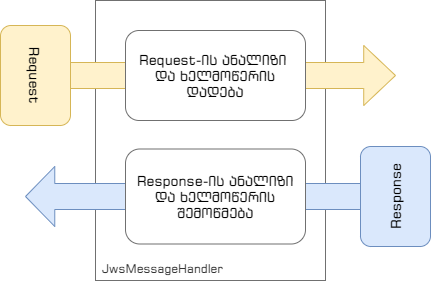

# TBC.OpenBanking.Jws

## JSON ვებხელმოწერა ღია ბანკინგის გარემოში

საქართველოში განხორციელებულია საქართველოს კანონმდებლობასთან თავსებადი [ღია ბანკინგის](https://www.association.ge/bank-projects-detail/10/ghia-bankingi/) დანერგვა [NextGenPSD2 XS2A ჩარჩოს](http://www.association.ge/OpenBankingDocuments/NextGenPSD2%20XS2A%20Implementation%20Guide%20v0.6%202020-09-16.pdf) საფუძველზე. ტექნიკური თვალსაზრისით ღია ბანკინგი წარმოადგენს RESTful API-ს, რომელსაც აქვეყნებს ანგარიშის მომსახურე საგადახდო მომსახურების პროვაიდერი (ამსმპ), ინგლისურად Account Servicing Payment Service Provider (ASPSP) და რომლის გამოყენებაც შეუძლია მესამე მხარის პროვაიდერს (მმპ), ინგლისურად Third Party Provider (TPP).

API-ს უსაფრთხოების მიზნით, სხვა საშუალებებთან ერთად, გამოყენებულია ციფრული ხელმოწერა. ღია ბანკინგის ფარგლებში ინფორმაციის გაცვლისას ნებისმიერი HTTP მოთხოვნა (Request) და პასუხი (Response) ციფრულად ხელმოწერილია შესაბამისი მომთხოვნის და მოპასუხეს მიერ. ხელმოწერა ხორციელდება ["JSON ვებხელმოწერის (JWS) განხორციელების სახელმძღვანელო ღია ფინანსების სისტემაში"](http://www.association.ge/OpenBankingDocuments/OpenFinance%20Json%20Web%20Signature%20Profile%200.5.RC1.pdf) სახელმძღვანელოს მიხედვით, რომელიც თავის მხრივ ძირითადში ეფუძნება ["Open Banking Europe. JSON Web Signature Profile for Open Banking"](https://www.openbankingeurope.eu/media/2095/obe-json-web-signature-profile-for-open-banking.pdf) და ["RFC 7515 - JSON Web Signature (JWS)"-ს](https://datatracker.ietf.org/doc/html/rfc7515).

რეპოზიტორი შეიცავს ორ ძირითად პროექტს და რამდენიმე მაგალითს

## პროექტი TBC.OpenBanking.Jws

ეს არის ბიბლიოთეკა, რომლის დახმარებით ზემოხსენებული სტანდარტით შესაძლებელია HTTP მოთხოვნის და HTTP პასუხის მონაცემებზე ხელმოწერის შექმნა და არსებული ხელმოწერის შემოწმება.

ბიბლიოთეკა დაწერილია C#-ის პროგრამირების ენაზე და თავსებადია .NET Standard 2.0-თან. დამოკიდებულია მხოლოდ კომპანია Microsoft-ის წარმოებულ კომპონენტებზე.

ბიბლიოთეკის გამოყენების მაგალითი განთავსებულია აქ [SampleConsole](https://github.com/TBCBank/TBC.OpenBanking.Jws/tree/master/src/examples/SampleConsole)

## პროექტი TBC.OpenBanking.Jws.Http

ეს არის ბიბლიოთეკა, რომელიც მნიშვნელოვნად ამარტივებს TBC.OpenBanking.Jws ბიბლიოთეკის გამოყენებას.

ბიბლიოთეკა დაწერილია C#-ის პროგრამირების ენაზე და თავსებადია .NET Standard 2.0-თან. დამოკიდებულია მხოლოდ კომპანია Microsoft-ის წარმოებულ კომპონენტებზე.

ბიბლიოთეკა შეიცავს ორ ძირითად კლასს

* class TBC.OpenBanking.Jws.Http.JwsMessageHandler
  DelegatingHandler-ის შვილობილი კლასი, რომელშიც განხორციელებულია TBC.OpenBanking.Jws-ის დახმარებით ღია ბანკინგის მოთხოვნების შესაბამისად HTTP მოთხოვნის ხელმოწერა და HTTP პასუხის ხელმოწერის შემოწმება
* class TBC.OpenBanking.Jws.Http.JwsClientOptions
  IOptions ინტერფეისის (Microsoft.Extensions.Options) იმპლემენტაციას, რომელიც გაძლევთ საშუალებას ხელმოწერის შექმნისათვის და შემოწმებისათვის საჭირო პარამეტრები მართოთ კონფიგურაციიდან

JwsMessageHandler-ის კლასი იძლევა საშუალებას ჩაჯდეთ Request-ის და Response-ის ჯაჭვში და შესაბამისად Request-ს დაადოთ ხელმოწერა, ხოლო Response-ს მოყოლილი ხელმოწერა შეამოწმოთ.



ბიბლიოთეკის გამოყენების მაგალითი განთავსებულია აქ [WebApiHttpClientExample](https://github.com/TBCBank/TBC.OpenBanking.Jws/tree/master/src/examples/WebApiHttpClientExample)

## მაგალითების პროექტები

რეპოზიტორიში მოცემულია სამი მაგალითი

### SampleConsole

ეს არის TBC.OpenBanking.Jws ბიბლიოთეკის გამოყენების მაგალითი.

დამატებითი ფაილები:

* "HttpRequest-001.txt" – ტექსტური ფაილი, რომელიც შეიცავს სამაგალითო HTTP მოთხოვნას
* "HttpResponse-001.txt" – ტექსტური ფაილი რომელიც შეიცავს სამაგალითო HTTP პასუხს
* keyandcert.pfx – პირადი გასაღების და სერტიფიკატის შემცველი ფაილი. ეს გასაღები და სერტიფიკატი გამოიყენება ხელმოწერის შექმნისათვის და შემოწმებისათვის
* rootCACert.crt – ძირი სერტიფიკატი.

**ყურადღება!** იმისათვის, რომ პროგრამა უშეცდომოდ იმუშაოს, "rootCACert.crt" ფაილში განთავსებული სერტიფიკატი უნდა განვათავსოთ Windows-ის "Trusted Root Certificate Authorities"-ს სათავსში. საქმე იმაშია, რომ ხელმოწერის შემოწმებაში ასევე შედის იმ სერტიფიკატის შემოწმება, რომლის მეწყვილე პირადი გასაღებით შეიქმნა ხელმოწერა. სერტიფიკატის შემოწმებისას ასევე მოწმდება სანდოა თუ არა ამ სერტიფიკატის "მშობელი". თუ სერტიფიკატი არ არის სანდო, ხდება ხელმოწერის შემოწმების შეცდომა.

პროგრამის მუშაობის მიმდევრობა ასეთია:

1. პროგრამა კითხულობს პირად გასაღებს და სერტიფიკატს "keyandcert.pfx" ფაილიდან
2. HTTP მოთხოვნის ხელმოწერა
   1. პროგრამა კითხულობს და პარსავს "HttpRequest-001.txt" ფაილს. იღებს მოთხოვნის თავსართების (headers) და ტანის (body) შიგთავს
   2. მიღებული მონაცემებით და TBC.OpenBanking.Jws დახმარებით ქმნის მოთხოვნის ციფრულ ხელმოწერას
   3. ქმნის ხელმოწერილ მოთხოვნას – არსებულ მოთხოვნას ემატება ორი თავსართი: "digest", სადაც განთავსებულია ტანის ჰეში და "x-jws-signature", სადაც განთავსებულია ციფრული ხელმოწერა
   4. ხელმოწერილი მოთხოვნა ინახავს ფაილში "SignedRequest.txt"
3. ხელმოწერილი HTTP მოთხოვნის ხელმოწერის შემოწმება
   1. პროგრამა კითხულობს და პარსავს "SignedRequest.txt" ფაილს. იღებს მოთხოვნის თავსართების (headers) და ტანის (body) შიგთავს
   2. მიღებული მონაცემებით და TBC.OpenBanking.Jws დახმარებით ამოწმებს მოთხოვნის ციფრულ ხელმოწერას
4. HTTP პასუხის ხელმოწერა
   1. პროგრამა კითხულობს და პარსავს "HttpResponse-001.txt" ფაილს. იღებს მოთხოვნის თავსართების (headers) და ტანის (body) შიგთავს
   2. მიღებული მონაცემებით და TBC.OpenBanking.Jws დახმარებით ქმნის მოთხოვნის ციფრულ ხელმოწერას
   3. ქმნის ხელმოწერილ მოთხოვნას – არსებულ მოთხოვნას ემატება ორი თავსართი: "digest", სადაც განთავსებულია ტანის ჰეში და "x-jws-signature", სადაც განთავსებულია ციფრული ხელმოწერა
   4. ხელმოწერილი მოთხოვნა ინახავს ფაილში "SignedResponse.txt"
5. ხელმოწერილი HTTP პასუხის ხელმოწერის შემოწმება
   1. პროგრამა კითხულობს და პარსავს "SignedResponse.txt" ფაილს. იღებს მოთხოვნის თავსართების (headers) და ტანის (body) შიგთავს
   2. მიღებული მონაცემებით და TBC.OpenBanking.Jws დახმარებით ამოწმებს მოთხოვნის ციფრულ ხელმოწერას

როგორც ხედავთ, პროგრამაში გატარებულია ყველა ის ქმედება რაც შეიძლება დაგჭირდეთ TBC.OpenBanking.Jws გამოყენებისას

#### TBC.OpenBanking.Jws კლასების გამოყენება მაგალითის მიხედვით

##### HTTP მოთხოვნის ხელმოწერა

JWS სტანდარტით HTTP მოთხოვნის ხელმოსაწერად გვჭირდება რამდენიმე ნაბიჯი

1. მონაცემების შეგროვება, რომელსაც ხელი უნდა მოვაწეროთ(ამოკრეფილი HTTP მოთხოვნიდან)
   გამოიყენება კლასი TBC.OpenBanking.Jws.HttpRequestData
2. ხელმომწერი პირადი გასაღების შესაბამისი სერტიფიკატის და მისი მშობელი სერტიფიკატების, გარდა ძირი (root) სერტიფიკატისა, ჯაჭვის მიღება
3. ალგორითმის და პირადი გასაღების განსაზღვრა, რომლითაც ეწერება ხელი მონაცემებს
   გამოიყენება კლასი TBC.OpenBanking.Jws.SupportedAlgorithms
4. ზედა ბიჯების შედეგების გამოყენებით ხელმოწერის შექმნა და შედეგის HTTP მოთხოვნაში განთავსება
   გამოიყენება კლასი TBC.OpenBanking.Jws.HttpSigner

განხილვისთვის გამოვიყენოთ ამონარიდი მაგალითიდან.

```c#
private static void SignHttpRequestSample(
    string algorithmName,
    string inFileName,
    string outFileName,
    X509Certificate2 publicKeyCert,
    X509Certificate2 privateKeyCert,
    ILoggerFactory loggerFactory)
{
    try
    {
        // Get HttpRequestData from HTTP Request
        var httpData = ReadHttpRequestDataFromString(File.ReadAllText(inFileName));

        // Get certificate chain
        // If it is possible, better to cache chain, because chain creation is slow
        X509Certificate2Collection chainCertificates = GetCertificateChain(publicKeyCert);

        // Get ISigner
        var signer = SupportedAlgorithms.CreateSigner(privateKeyCert, algorithmName);

        // Create HttpSigner.
        // Need ISigner, certificate with signer's public key and
        // certificate chain in X509Certificate2Collection
        var reqSign = new HttpSigner<HttpRequestData>(loggerFactory.CreateLogger<HttpSigner<HttpRequestData>>())
        {
            Signer = signer,
            SignerCertificate = publicKeyCert,
            SignerCertificateChain = chainCertificates
        };

        // Create signature
        reqSign.CreateSignature(httpData);

        if (reqSign.IsSignatureCreated)
        {
            httpData.Headers.Add(HttpMessageData.DigestHeadertName, reqSign.DigestHeaderValue);
            httpData.Headers.Add(HttpMessageData.SignatureHeaderName, reqSign.SignatureHeaderValue);

            WriteHttpRequestDataToFile(httpData, outFileName);
        }
    }
    catch (Exception x)
    {
        Console.Error.WriteLine(x.ToString());
    }
}
```

<ins>პირველი ნაბიჯი</ins>: HttpRequestData კლასის ობიექტის შექმნა და შევსება. ხელმოწერისათვის საჭიროა HTTP მოთხოვნიდან HttpRequestData კლასის ობიექტში გადმოვიტანოთ ყველა თავსართი (header-ი), HTTP გამოძახების მეთოდი (post, get და ა.შ.) და HTTP გამოძახების შიგთავსი (body).

```c#
    // Get HttpRequestData from HTTP Request
    var httpData = ReadHttpRequestDataFromString(File.ReadAllText(inFileName));
```

<ins>მეორე ნაბიჯი</ins>: ვიღებთ ხელმომწერი პირადი გასაღების სერტიფიკატის მშობლებს (ძირი (root) სერტიფიკატის გარდა) და ვქმნით სერტიფიკატების ჯაჭვს. სერტიფიკატების ჯაჭვის შექმნის კოდი შეგიძლიათ ნახოთ GetCertificateChain ფუნქციაში.

```c#
    // Get certificate chain
    // If it is possible, better to cache chain, because chain creation is slow
    X509Certificate2Collection chainCertificates = GetCertificateChain(publicKeyCert);
```

<ins>მესამე ნაბიჯი</ins>: ალგორითმის და პირადი გასაღების დადგენა. TBC.OpenBanking.Jws.SupportedAlgorithms კლასის CreateSigner მეთოდით ვქმნით ISigner ინტერფეისის იმპლემენტაციის ობიექტს. როგორც ხედავთ, ფუნქციას გადაეცემა პირადი გასაღების შემცველი X509Certificate2 ობიექტი და ხელმოწერის ალგორითმის ტექსტური დასახელება.

```c#
    // Get ISigner
    var signer = SupportedAlgorithms.CreateSigner(privateKeyCert, algorithmName);
```

დღევანდელი მდგომარეობით მხარდაჭერილია ალგორითმები:

| ტექსტური დასახელება | ალგორითმის აღწერა                              |
| ------------------- | ---------------------------------------------- |
| "RS256"             | RSASSA-PKCS1-v1_5 using SHA-256                |
| "RS384"             | RSASSA-PKCS1-v1_5 using SHA-384                |
| "RS512"             | RSASSA-PKCS1-v1_5 using SHA-512                |
| "PS256"             | RSASSA-PSS using SHA-256 and MGF1 with SHA-256 |
| "PS384"             | RSASSA-PSS using SHA-384 and MGF1 with SHA-384 |
| "PS512"             | RSASSA-PSS using SHA-512 and MGF1 with SHA-512 |
| "ES256"             | ECDSA using P-256 and SHA-256                  |
| "ES384"             | ECDSA using P-384 and SHA-384                  |
| "ES512"             | ECDSA using P-521 and SHA-512                  |

<ins>მეოთხე ნაბიჯი</ins>: ხელმოწერისათვის ვიყენებთ კლასს HttpSigner. ამ კლასს შეუძლია როგორც HTTP მოთხოვნის, ასევე HTTP პასუხის ხელმოწერა. განსხვავება არის მხოლოდ იმ მონაცემების კლასში რაც გადაეცემა. ამ შემთხვევაში იქმნება HttpSigner კლასის ობიექტი HttpRequestData მონაცემთა ტიპისათვის. ასევე ვაყენებთ Signer (პირადი გასაღები და ალგორითმი), SignerCertificate (ხელმომწერი პირადი გასაღების შესაბამისი სერტიფიკატი) და SignerCertificateChain (სერტიფიკატის მშობლების ჯაჭვი).

ხელმოწერას ვახორციელებთ CreateSignature ფუნქციით, რომელსაც გადაეცემა HTTP გამოძახების მონაცემები განთავსებული HttpRequestData კლასის ტიპის ობიექტით httpData.

თუ ხელმოწერა დასრულდა წარმატებით, HttpSigner-ს ველი DigestHeaderValue შეივსება მნიშვნელობით, რომელიც უნდა განთავსდეს HTTP მოთხოვნის "digest" თავსართში (header) და ველი SignatureHeaderName შეივსება მნიშვნელობით , რომელიც უნდა განთავსდეს HTTP მოთხოვნის "x-jws-signature" თავსართში (header).


```C#
    // Create HttpSigner.
    // Need ISigner, certificate with signer's public key and
    // certificate chain in X509Certificate2Collection
    var reqSign = new HttpSigner<HttpRequestData>(loggerFactory.CreateLogger<HttpSigner<HttpRequestData>>())
    {
        Signer = signer,
        SignerCertificate = publicKeyCert,
        SignerCertificateChain = chainCertificates
    };

    // Create signature
    reqSign.CreateSignature(httpData);
```

სულ ეს არის :)

##### ხელმოწერილი HTTP მოთხოვნის შემოწმება

JWS სტანდარტით ხელმოწერილი HTTP მოთხოვნის შემოწმებას სჭირდება რამდენიმე ნაბიჯი:

1. მონაცემების შეგროვება, რომელსაც ხელი უნდა მოვაწეროთ(ამოკრეფილი HTTP მოთხოვნიდან)
   გამოიყენება კლასი TBC.OpenBanking.Jws.HttpRequestData
2. HTTP მოთხოვნის შემოწმება. რაშიც შედის
   1. ხელმოწერის შემოწმება
   2. სერტიფიკატების შემოწმება
   3. დამატებითი შემოწმება (ხანგრძლივობის შემოწმება)

განხილვისთვის გამოვიყენოთ ამონარიდი მაგალითიდან.

```c#
    private static void VerifyHttpRequestSignatureSample(string inFileName, ILoggerFactory loggerFactory)
    {
        try
        {
            // Get HttpRequestData from HTTP Request
            var httpData = ReadHttpRequestDataFromString(File.ReadAllText(inFileName));

            var verifier = new HttpSignatureVerifier<HttpRequestData>(
                loggerFactory.CreateLogger<HttpSignatureVerifier<HttpRequestData>>())
            {
                // Disable time check for sample sake
                CheckSignatureTimeConstraint = false,
                // Disable revocation check  for sample sake
                CertificateValidationFlags = new CertificateValidationFlags
                {
                    RevocationMode = X509RevocationMode.NoCheck,
                    VerificationFlags = X509VerificationFlags.AllFlags
                }
            };

            verifier.VerifySignature(httpData, DateTime.Now);
        }
        catch (Exception x)
        {
            Console.Error.WriteLine(x.ToString());
        }
    }
```

<ins>პირველი ნაბიჯი</ins>: HttpRequestData კლასის ობიექტის შექმნა და შევსება. ხელმოწერისათვის საჭიროა HTTP მოთხოვნიდან HttpRequestData კლასის ობიექტში გადმოვიტანოთ ყველა თავსართი (header-ი), HTTP გამოძახების მეთოდი (post, get და ა.შ.) და HTTP გამოძახების შიგთავსი (body). როგორც ხელმოწერის შექმნიდან იცით, ხელმოწერის მონაცემი და დაიჯესტი ასევე თავსართებშია განთავსებული.

```C#
    // Get HttpRequestData from HTTP Request
    var httpData = ReadHttpRequestDataFromString(File.ReadAllText(inFileName));
```

### WebApiHttpClientExample

ამ პროექტში თქვენ შეგიძლიათ ნახოთ როგორ ხდება სრულფასოვანი ღია ბანკინგის აპის გამოძახება, თანმხლები ციფრული ხელმოწერა და ციფრული ხელმოწერის შემოწმება. ციფრულ ხელმოწერასთან მუშაობა ხორციელდება დამხმარე კლასის JwsMessageHandler დახმარებით.

პროექტი წარმოადგენს მარტივ ვებაპის ერთად-ერთი GET გამოძახებით. ვებაპის მაგალითი მოყვანილია იმ მოსაზრებით, რომ, დიდი ალბათობით, ღია ბანკინგის იმპლემენტაციაში თავადაც აპის შექმნა დაგჭირდებათ, რომელიც თქვენთვის გარე ბანკებზე მიმართვას შეფუთავს

#### კონფიგურაცია

აპლიკაციის კონფიგურაცია სტანდარტულად განლაგებულია "appsettings.json" ფაილში. გვაქვს პარამეტრების ორი ჯგუფი. პირველია შეერთების პარამეტრები, რომელიც განთავსებულია "OpenBankingConnection" სექციაში.

* BaseUrl – ღია ბანკინგის აპის მისამართი
* ClientCertificate – კლიენტის (ჩვენი) mTLS სერტიფიკატის მდებარეობა

მეორეა Jws ხელმოწერის პარამეტრები, რომელიც განთავსებულია "Jws" სექციაში.

* Enabled – ხელმოწერის კომპონენტის ჩართვა/გამორთვა
* AlgorithmName – ხელმოწერის ალგორითმის სახელი
* SigningCertificate – ხელმოწერის სერტიფიკატი (უნდა შეიცავდეს პირად/დახურულ გასაღებსაც)
* CheckSignatureTimeConstraint – ხელმოწერის დროის შეზღუდვის შემოწმება. ჩართვა/გამორთვა
* CheckCertificateRevocationList – სერტიფიკატის გაუქმების შემოწმება. ჩართვა/გამორთვა
* ValidateSignature – ხელმოწერის შემოწმება. ჩართვა/გამორთვა

სერტიფიკატებისათვის მდებარეობა შესაძლებელია მიუთითო როგორც ფაილში ასევე ოპერაციული სისტემის სერტიფიკატების საცავში.

#### სერტიფიკატები

პროგრამას მუშაობისათვის სჭირდება ორი ტიპის სერტიფიკატი. პირველი არის mTLS-ის კლიენტის სერტიფიკატი, რომელიც გამოიყენება ავთენტიფიკაციისათვის და მეორე ციფრული ხელმოწერის სერტიფიკატი.

მიმდინარე პროექტში მაგალითისათვის ჩვენ ვიყენებთ თიბისი ბანკის ღია ბანკინგის სატესტო გარემოს, რომლისთვისაც დასაშვებია მხოლოდ საბანკო ასოციაციის მიერ გაცემული სატესტო სერტიფიკატები. შესაბამისად ან საბანკო ასოციაციის სერტიფიკატი უნდა აიღოთ (ამ მიმართულებით ვერ გიშველით), ან მოსინჯოთ სხვა ბანკების სატესტო გარემო. პროტოკოლი ყველა ბანკისათვის ერთნაირია, ასე რომ მხოლოდ სერტიფიკატის მითითება დაგჭირდებათ.

სერტიფიკატი შეიძლება განათავსოთ ფაილში (ისეთ ფორმატში, რომელიც .NET-ს ესმის. მაგალითად, PFX-ი) ან Windows-ის სერტიფიკატების საცავში.

ფაილის შემთხვევაში სერტიფიკატის მითითება ხდება ასეთი სტრიქონით:


* pfx – არის სქემის სახელი და უცვლელად უნდა დარჩეს
* password – თუ ფაილს ადევს პაროლი, შეგიძლიათ ამ მდებარეობაში მიუთითოთ. პაროლის მერე აუცილებელია გამყოფი `@`. თუ პაროლი შეიცავს URI ფორმატისათვის მიუღებელ სიმბოლოს შეგიძლიათ ე.წ. ესკეიპინგით მიუთითოთ. მაგალითად თუ პაროლში არის `p@ssword`, @ სიმბოლოს მაგივრად შეგიძლიათ დაწეროთ %40 – `p%40ssword`
* localhost – კონსტანტური მნიშვნელობაა და არ იცვლება
* path – ფაილის მდებარეობა დისკზე

მაგალითად:

```text
pfx://localhost/c:\\Apps\\Certs\\mycrypto.pfx
pfx://secretword@localhost/c:\\Apps\\Certs\\mycrypto.pfx
```

უპაროლო PFX ფაილის შემთხვევაში შესაძლებელია ცარიელი host-ის დატოვება:

```text
pfx:///c:\\Apps\\Certs\\mycrypto.pfx
```

საცავის შემთხვევაში სერტიფიკატის მდებარეობის მითითება ხდება ასეთი სტრიქონით:


* cert – არის სქემის სახელი და უცვლელად უნდა დარჩეს
* StoreLocation – შეიძლება იყოს
  * `CurrentUser` – მიმდინარე მომხმარებლის კერძო საცავი
  * `LocalMachine` – სერვერის საცავი
* StoreName – მნიშვნელობა შეიძლება იყოს ერთ-ერთი ამათგანი [StoreName Enum](https://docs.microsoft.com/en-us/dotnet/api/system.security.cryptography.x509certificates.storename?view=net-5.0#fields)
* CertificateThumbprint – არის სერტიფიკატის SHA-1 ანაბეჭდი

მაგალითად:

```text
cert:///CurrentUser/My/CBB4A6C757F4F4798B94ABEB621D7C545E0A656E
```

#### აპლიკაციის Startup-ი

სამაგალითო აპლიკაციის ძირითადი "ფასეულობა" არის, თუ როგორ უნდა დავაკონფიგურიროთ Startup.cs-ში HttpClient-ი ისე რომ ხელმოწერა და ხელმოწერის შემოწმება სწორად მოხდეს. ჩაიხედეთ Startup.cs-ში. მოძებნეთ სტრიქონი `"AddHttpClient"`.

HttpClient-ის დამატებისას მიაქციეთ ყურადღება

* მიმართვის მისამართს (client.BaseAddress) იღებს კონფიგურაციიდან
* კლიენტის სერტიფიკატსაც იღებს კონფიგურაციიდან (ClientCertificates.Add)
* ამ მაგალითისათვის mTLS-ში გათიშულია სერვერის სერტიფიკატის შემოწმება (ServerCertificateCustomValidationCallback), თუმცა რეალურ პროგრამაში ამის გათიშვა არ უნდა მოხდეს!
* HttpClient-ში ხდება MessageHandler-ის დამატება (AddHttpMessageHandler). კერძოდ, ემატება JwsMessageHandler, რომელიც თავის თავზე იღებს გაგზავნილის ხელმოწერას და მიღებულის ხელმოწერის შემოწმებას

#### გაშვების ბიჯები

მოკლედ დავწეროთ როგორ უნდა მოამზადოთ აპლიკაცია გასაშვებად:

* უნდა აიღოთ/იშოვოთ სერტიფიკატები. ერთი mTLS-ის, მეორე ციფრული ხელმოწერის იმის გათვალისწინებით, რომ ზოგი სატესტო გარემო მოითხოვს სპეციფიკურ სერტიფიკატებს და თვითგენერირებული არ გამოდგება
* გაიგეთ სატესტო გარემოს მისამართი (Base url)

ზედა მონაცემების დაყრდნობით გაწერეთ კონფიგურაცია "appsettings.json" ფაილში და გაუშვით პროგრამა.

როგორც იცით ეს არის მინიმალისტური WebAPI-ის აპლიკაცია. ერთად-ერთი ქმედება რასაც აკეთებს, არის სატესტო გარემოში თანხმობის (consent) შექმნა. გაშვების შემდეგ შეგიძლიათ თუნდაც [cURL-ის](https://curl.se/) დახმარებით შეამოწმოთ (პორტის მნიშვნელობა შეიძლება განსხვავებული იყოს თქვენთან)

```text
curl http://localhost:24484/CreateConsent
```

თუ გამოძახება დასრულდა წარმატებით API დააბრუნებს თანხმობის ჩანაწერს დაახლოებით ასეთს

```json
{"consentStatus":"received","consentId":"ee0e2d45-24e4-4139-b12c-96b4647959bb","_links":{"scaOAuth":{"href":"https://test-openbanking.tbcbank.ge/openbanking/oauth/.well-known/oauth-authorization-server"},"self":{"href":"/0.8/v1/consents/ee0e2d45-24e4-4139-b12c-96b4647959bb"},"status":{"href":"/0.8/v1/consents/ee0e2d45-24e4-4139-b12c-96b4647959bb/status"},"scaStatus":{"href":"/0.8/v1/consents/ee0e2d45-24e4-4139-b12c-96b4647959bb/authorisations/78aae796-bbda-4542-926c-08d99ecf2c91"}}}
```

### ConsoleHttpClientExample

ამ პროექტის დახმარებით თქვენ შეგიძლიათ ნახოთ რა იგზავნება ღია ბანკინგის API-ში. პროექტი ღია ბანკინგის გამოძახებას აგზავნის [httpbin](https://httpbin.org/) ვერგვერდზე. ეს ვებგვერდი მოთხოვნის პასუხში აბრუნებს მოთხოვნების შიგთავს. შედეგად შეგიძლიათ ნახოთ საბოლოოდ რა მოთხოვნა იგზავნება ხელმოწერის დადების შემდეგ.

Httpbin-ზე შესაერთებლად mTLS საჭირო არ არის. შესაბამისად გვჭირდება მხოლოდ ხელმოწერის სერტიფიკატი. ხელმოწერის სერტიფიკატი შეიძლება იყოს ნებისმიერი თქვენს მიერ დაგენერირებული გასაღების წყვილის შემცველი და თუგინდ თვითხელმოწერილი (self-signed) სერტიფიკატი. სერტიფიკატის მდებარეობა პროგრამას პარამეტრად უნდა გადასცეთ.

ეს არის შედეგი, რომელიც ბრუნდება httpbin-დან. მიაქციეთ ყურადღება რომ დამატებულია ორი თავსართი (header) "Digest" და "X-Jws-Signature". ორივე თავსართი ხელმოწერის ნაწილია. "origin" ველში ჩაწერილი IP მისამართი შეცვლილია არარეალურით.

```json
{
  "args": {},
  "data": "{ \"Hello\": \"World\" }",
  "files": {},
  "form": {},
  "headers": {
    "Content-Length": "20",
    "Content-Type": "text/plain; charset=utf-8",
    "Digest": "SHA-256=t67VXtAvlq2Gdu3AkoH1wsgYtxfUwfth68FIkjMZbkA=",
    "Host": "httpbin.org",
    "X-Amzn-Trace-Id": "Root=1-61851865-5fbef77e6e514a1f4e3b9ecb",
    "X-Jws-Signature": "eyJiNjQiOmZhbHNlLCJ4NWMiOlsiTUlJSGJEQ0NCVlNnQXdJQkFnSVVLWTJhM2xWNmtpeHRoN2pRSXlLcEdJQlRKS0l3RFFZSktvWklodmN ... ... ... gAxUjRkW-7Mr5Bll9RusHqBiaFz1eCMLvZV-mwiJrEtMU5A1kFP8EPCf1wR-w"
  },
  "json": {
    "Hello": "World"
  },
  "origin": "233.252.0.1",
  "url": "https://httpbin.org/post"
}
```
